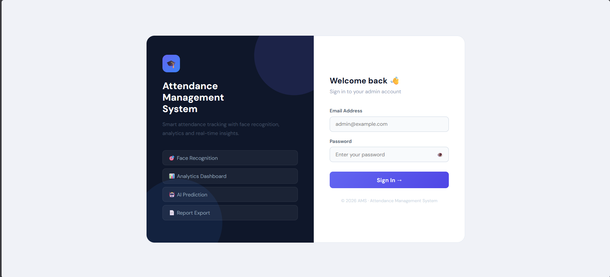
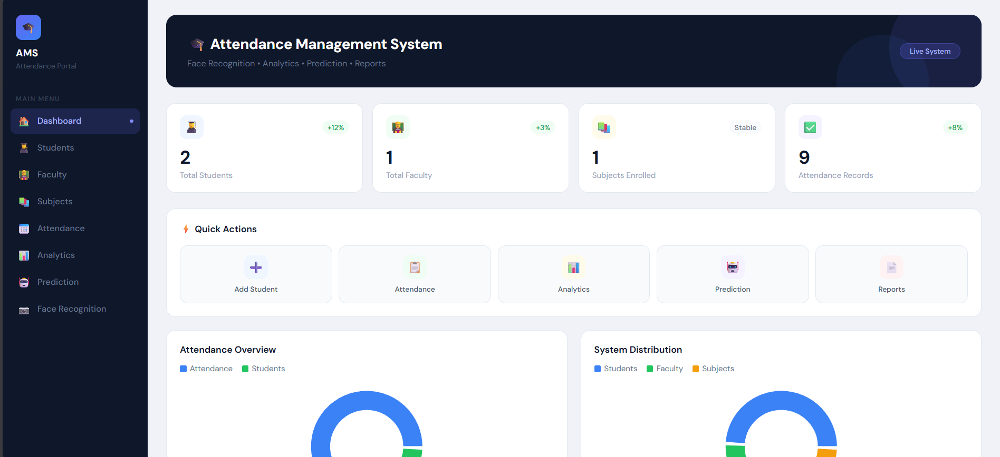
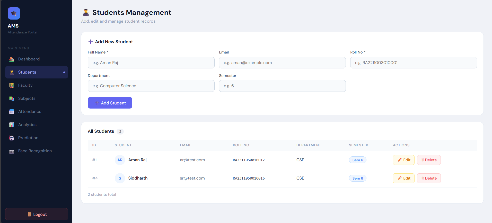
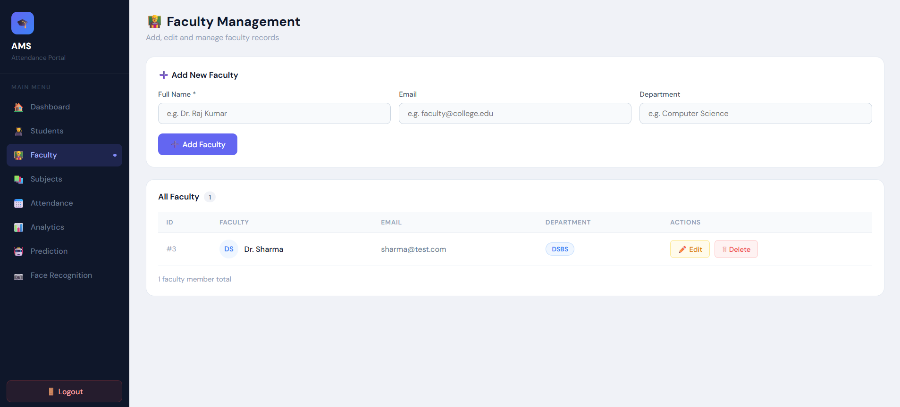
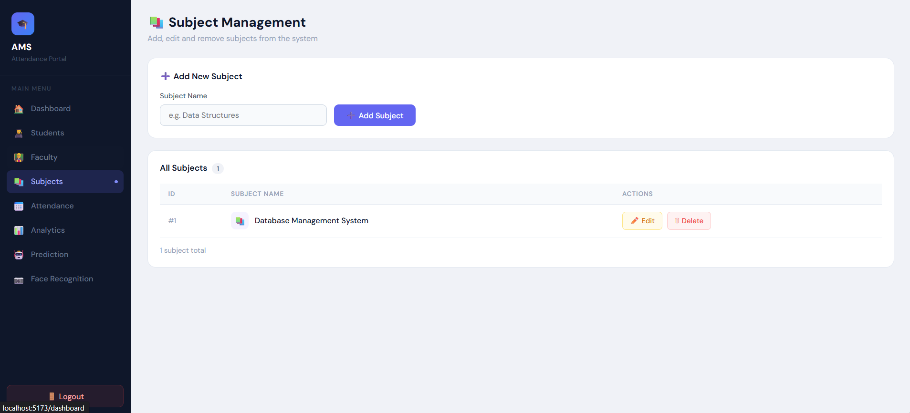
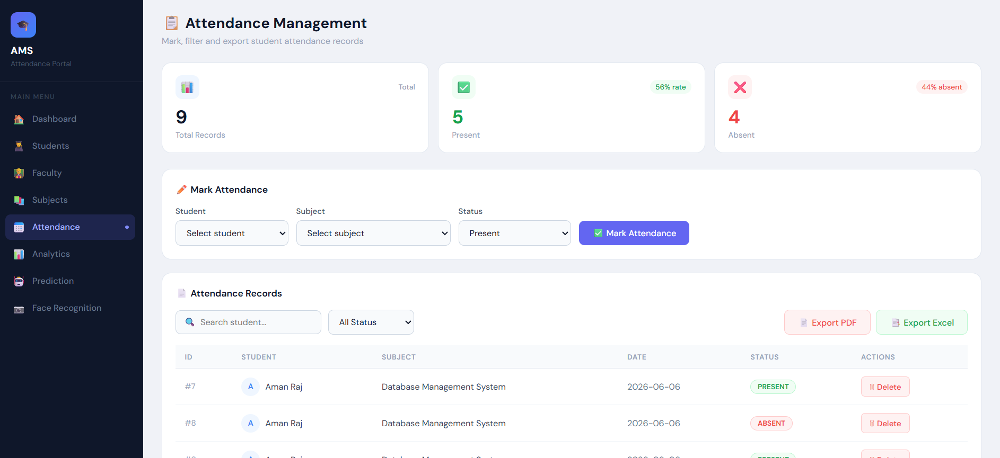
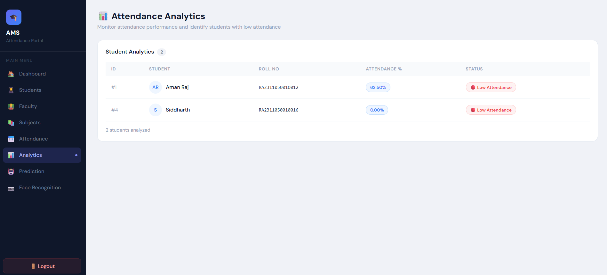
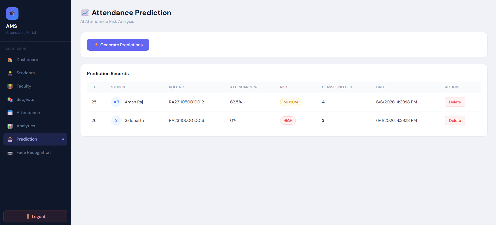
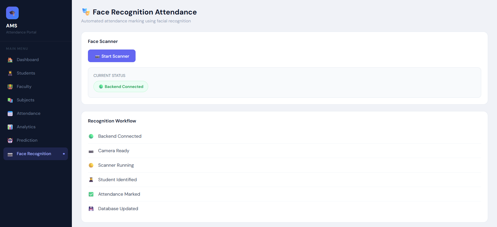

🎓 Attendance Management System

## Overview

The Smart Attendance Management System is a full-stack web application developed to automate attendance management in educational institutions.

It's an AI-Powered Attendance Management System built using React, Spring Boot, TiDB Cloud (MySQL), JWT Authentication, and OpenCV Face Recognition.

The system provides modules for student management, faculty management, subject management, attendance tracking, attendance analytics, attendance prediction, report generation, and face-recognition-based attendance marking.


---

# 🚀 Live Deployment

## Frontend (Vercel)

https://attendance-management-system-pink.vercel.app

## Backend API (Render)

https://attendance-backend-0sk5.onrender.com

## Swagger Documentation

https://attendance-backend-0sk5.onrender.com/swagger-ui/index.html

## Live Demo

Frontend:
https://attendance-management-system-pink.vercel.app

Backend:
https://attendance-backend-0sk5.onrender.com

## Demo Login

Email: admin@test.com

Password: admin123

---

# Key Features

## Authentication

* JWT-Based Login
* User Registration
* Secure API Access
* Protected Routes

## Student Management

* Add Student
* Update Student
* Delete Student
* View Students


## Faculty Management

* Add Faculty
* Update Faculty
* Delete Faculty
* View Faculty

## Subject Management

* Add Subject
* Update Subject
* Delete Subject
* View Subjects

## Attendance Management

* Mark Attendance
* View Attendance Records
* Delete Attendance
* Attendance Percentage Calculation
* Low Attendance Detection

## Attendance Analytics

* Attendance Percentage Monitoring
* Attendance Statistics Dashboard
* Low Attendance Identification

## Attendance Prediction

* Risk Prediction
* LOW Risk Classification
* MEDIUM Risk Classification
* HIGH Risk Classification
* Classes Needed to Reach 75% Attendance

## Face Recognition Attendance

* Face Dataset Generation
* Face Model Training
* Face Recognition Scanner
* Automatic Attendance Recording

## Reports

* PDF Attendance Report
* Excel Attendance Report

---

# Technology Stack

## Frontend

* ReactJS
* React Router DOM
* Axios
* Recharts
* Vite

## Backend

* Spring Boot
* Spring Security
* Spring Data JPA
* JWT Authentication
* Hibernate

## Database

* TiDB Cloud (MySQL Compatible)

## Face Recognition Module

* Python
* OpenCV
* Haar Cascade Classifier
* LBPH Face Recognizer

## Development Tools

* IntelliJ IDEA
* VS Code
* MySQL Workbench
* Postman
* Swagger UI
* GitHub

---

## 🏗 System Architecture Overview

The Attendance Management System follows a multi-layered architecture consisting of:

1. Presentation Layer (React Frontend)
2. API Layer (Spring Boot REST APIs)
3. Business Logic Layer (Service Layer)
4. Data Access Layer (JPA Repository Layer)
5. Database Layer (TiDB Cloud)
6. Face Recognition Layer (Python + OpenCV)

---

## High-Level Architecture

```text
+------------------------------------------------+
|                React Frontend                  |
|------------------------------------------------|
| Login | Dashboard | Students | Faculty         |
| Subjects | Attendance | Analytics             |
| Prediction | Face Recognition                 |
+------------------------+-----------------------+
                         |
                         | HTTP Requests
                         v
+------------------------------------------------+
|            Spring Boot REST APIs               |
|------------------------------------------------|
| Auth Controller                                |
| Student Controller                             |
| Faculty Controller                             |
| Subject Controller                             |
| Attendance Controller                          |
| Prediction Controller                          |
| Report Controller                              |
| Dashboard Controller                           |
| Face Recognition Controller                    |
+------------------------+-----------------------+
                         |
                         | Service Calls
                         v
+------------------------------------------------+
|              Business Logic Layer              |
|------------------------------------------------|
| Auth Service                                   |
| Student Service                                |
| Faculty Service                               |
| Subject Service                               |
| Attendance Service                            |
| Prediction Service                            |
| Dashboard Service                             |
| Report Service                                |
+------------------------+-----------------------+
                         |
                         | JPA/Hibernate
                         v
+------------------------------------------------+
|              Repository Layer                  |
|------------------------------------------------|
| Student Repository                             |
| Faculty Repository                             |
| Subject Repository                             |
| Attendance Repository                          |
| Prediction Repository                          |
+------------------------+-----------------------+
                         |
                         | SQL Queries
                         v
+------------------------------------------------+
|             TiDB Cloud Database                |
+------------------------------------------------+
```

---

## 🤖 Face Recognition Architecture

```text
+----------------------------------+
|      Face Recognition UI         |
|      (React Frontend)            |
+---------------+------------------+
                |
                |
                v
+----------------------------------+
|      Python OpenCV Module        |
|----------------------------------|
| dataset_generator.py             |
| train.py                         |
| recognize.py                     |
+---------------+------------------+
                |
                |
                v
+----------------------------------+
|      Face Detection Model        |
|----------------------------------|
| Haar Cascade Classifier          |
| LBPH Recognizer                  |
+---------------+------------------+
                |
                |
                v
+----------------------------------+
|      Spring Boot Attendance API  |
|----------------------------------|
| POST /api/attendance             |
+---------------+------------------+
                |
                |
                v
+----------------------------------+
|      TiDB Cloud Database         |
+----------------------------------+
```

---

## 🔐 Authentication Flow

```text
User Login
     |
     v
React Login Page
     |
     v
POST /api/auth/login
     |
     v
Spring Security Authentication
     |
     v
JWT Token Generated
     |
     v
Token Stored in Browser
(localStorage)
     |
     v
Protected API Access
```

---

##  📊 Attendance Prediction Flow

Student Attendance Records
            |
            v
Attendance Service
            |
            v
Calculate Attendance Percentage
            |
            v
Prediction Service
            |
            +----> Attendance >= 75%
            |           LOW RISK
            |
            +----> Attendance >= 60%
            |           MEDIUM RISK
            |
            +----> Attendance < 60%
                        HIGH RISK
            |
            v
Prediction Stored
            |
            v
Displayed in Prediction Dashboard
```

---

## Attendance Recovery Calculation

```text
Current Attendance %
          |
          v
Check if Attendance < 75%
          |
          v
Calculate Additional Classes Needed
          |
          v
Display:
"Classes Required To Reach Safe Attendance"
```

---

## Report Generation Flow

```text
Attendance Records
        |
        v
Report Controller
        |
        +----> PDF Report
        |
        +----> Excel Report
        |
        v
Download File
```

---

## 📈 Dashboard Analytics Flow


Students Data
Faculty Data
Subjects Data
Attendance Data
Prediction Data
        |
        v
Dashboard Service
        |
        v
Aggregated Statistics
        |
        v
React Dashboard Charts
(Recharts)
```

---

## 🗄 Database Relationships


Student
   |
   | One Student
   |
   v
Attendance
   ^
   |
   | Many Attendance
   |
Subject

Student
   |
   v
Attendance Prediction

User
   |
   v
Authentication

### Entity Relationships

Student (1) ------ (Many) Attendance

Subject (1) ------ (Many) Attendance

Student (1) ------ (Many) AttendancePrediction

User (1) ------ Authentication & Authorization


---

# 📡 API Modules

## Authentication APIs

POST /api/auth/register

POST /api/auth/login

---

## Student APIs

GET /api/students

GET /api/students/{id}

POST /api/students

PUT /api/students/{id}

DELETE /api/students/{id}

GET /api/students/roll/{rollNo}

GET /api/students/department/{department}

---

## Faculty APIs

GET /api/faculty

GET /api/faculty/{id}

POST /api/faculty

PUT /api/faculty/{id}

DELETE /api/faculty/{id}

---

## Subject APIs

GET /api/subjects

GET /api/subjects/{id}

POST /api/subjects

PUT /api/subjects/{id}

DELETE /api/subjects/{id}

---

## Attendance APIs

GET /api/attendance

POST /api/attendance

DELETE /api/attendance/{id}

GET /api/attendance/student/{studentId}

GET /api/attendance/subject/{subjectId}

GET /api/attendance/percentage/{studentId}

GET /api/attendance/low/{studentId}

GET /api/attendance/required/{studentId}

---

## Prediction APIs

GET /api/predictions

POST /api/predictions

POST /api/predictions/generate/{studentId}

GET /api/predictions/student/{studentId}

DELETE /api/predictions/{id}

---

## Reports APIs

GET /api/reports/attendance/pdf

GET /api/reports/attendance/excel

---

## Dashboard APIs

GET /api/dashboard

---

## Face Recognition APIs

GET /api/face/status

---

# Project Screenshots

## Login Page



---

## Dashboard



---

## Student Management



---

## Faculty Management



---

## Subject Management



---

## Attendance Management



---

## Attendance Analytics



---

## Attendance Prediction



---

## Face Recognition Attendance



---

# ⚙️ Database Configuration

spring.datasource.url=YOUR_DATABASE_URL
spring.datasource.username=YOUR_USERNAME
spring.datasource.password=YOUR_PASSWORD

spring.jpa.hibernate.ddl-auto=update
spring.jpa.show-sql=true

---

# 🚀 Installation Guide

## Backend

.\mvnw.cmd spring-boot:run

.\mvnw.cmd clean install

Backend URL:

http://localhost:8080

Swagger:

http://localhost:8080/swagger-ui/index.html

---

## Frontend

Open frontend folder:

npm install

npm run dev

Frontend URL:

http://localhost:5173

---

## Face Recognition

Capture dataset:

python dataset_generator.py

Train model:

python train.py

Run recognition:

python recognize.py

---

## 📂 Project Structure

Attendance-Management-System
│
├── backend
├── frontend
├── database
├── face-recognition-module
├── screenshots
├── README.md
└── LICENSE

---

# 🔮 Future Enhancements

Real-Time Camera Streaming
Student Portal
Faculty Portal
Mobile Application
Email Notification System
Advanced AI Prediction Models
Attendance Trend Forecasting
Cloud Storage Integration
Dark Mode


---

# Author

Aman Raj

B.Tech Computer Science & Engineering

